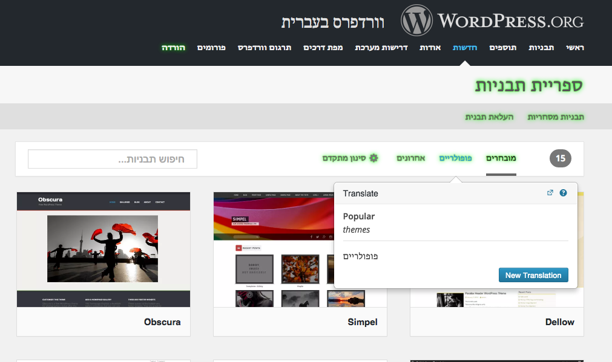

# Community Translator
The Community Translator aims to be a front end tool for translations stored in GlotPress.
It does so by providing on-screen translation ability, so that the community can easily fix a missing translation in-place and make use of the context in which the string appears.



### Requirements
- jQuery
- The [GlotPress as a WordPress plugin](https://github.com/GlotPress/GlotPress-WP)
- The [`gp-translation-extended-api`](https://github.com/david-binda/gp-extended-api-plugins) plugin for GlotPress as a WordPress plugin

### Build
To create the `community-translator.js` and `community-translator.css` files which should be loaded in the translatable site.

* run `npm install`
* run `make`.

You can also use `fswatch-run lib css make` to watch the directories `lib` and `css` for changed files and run `make` automatically.

### Loading

The code in this repository is loaded by including the script as follows (generated above).
```
<head>[...]<link rel="stylesheet" type="text/css" href="community-translator.css" />[...]</head>
<!-- Page Content -->
<script type="text/javascript" src="community-translator.js"></script>
<script type="text/javascript">
<!-- server-side component output: translatorJumpstart = {...} -->
communityTranslator.load();
</script>
```

**Note** a [server-side component](docs/server-side-component.md) is needed.


You might want to load the translator with a button, see the [documentation about loading](docs/loading.md) for details.

### Debugging
Set or add `community-translator` to the `debug` value in localeStorage. i.e: `localStorage.setItem( 'debug', 'community-translator' )`

